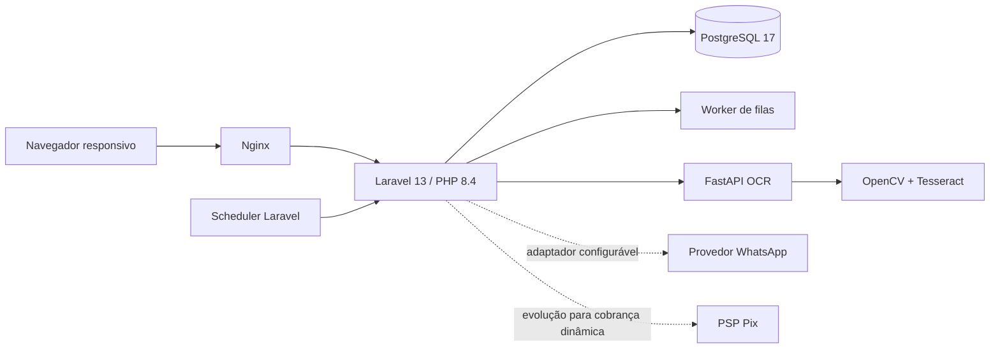
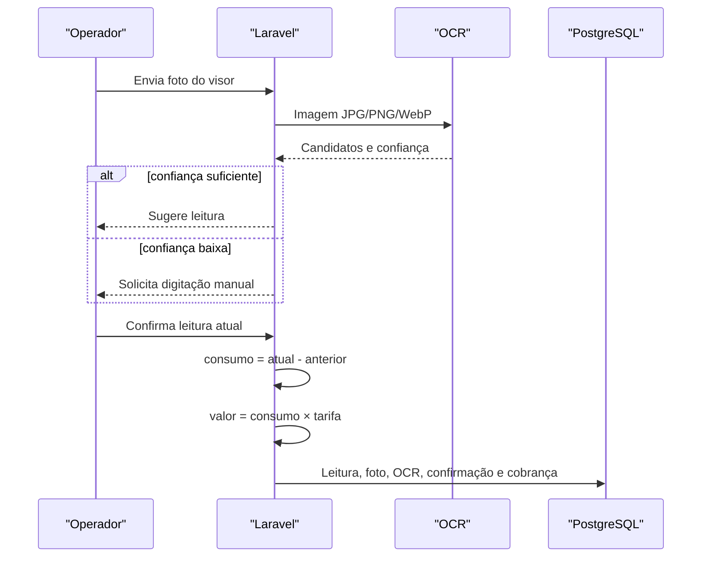

# Arquitetura

## Visão geral

O Laravel concentra interface, autenticação, autorização, regras de negócio e persistência. O OCR é isolado porque possui dependências próprias de visão computacional. Nginx publica apenas o frontend HTTP; banco e OCR ficam na rede interna do Compose.

## Áreas e permissões

- Público: consulta de imóveis disponíveis e envio de proposta.
- Cliente (`role:client`): apenas seus aluguéis, cobranças e contratos.
- Gestão (`role:admin,manager`): cadastros, cobranças, medições e contratos.
- Administrador: mesma área de gestão; a separação de permissões mais granular pode ser acrescentada usando o campo `permission` do menu.

As consultas do portal validam vínculo entre o usuário autenticado e o cliente, impedindo acesso horizontal a recursos de terceiros.

## Domínio persistido

| Agregado | Tabelas principais |
|---|---|
| Identidade | `users`, `clients`, `client_documents` |
| Imóveis | `groups`, `properties`, `property_photos`, `features` |
| Locação | `leases`, `lease_documents`, `condominium_rules` |
| Financeiro | `charges`, `pix_payments`, `notification_logs` |
| Energia | `solar_configs`, `solar_readings` |
| Contratos | `contracts` (modelos-base), `lease_contracts` (versões por aluguel), `contract_signatures`, `otp_codes` |
| Configuração | `companies`, `menus` |

Fotos e documentos são mantidos em Base64 conforme o requisito inicial. Para alto volume, recomenda-se migrar os binários para armazenamento de objetos privado e manter no PostgreSQL somente metadados, hash e chave do objeto.

## Fluxo de energia solar

Regras de integridade: uma medição por configuração/mês, leitura atual não inferior à anterior, uma cobrança solar por aluguel/mês e confirmação humana sempre obrigatória.

## Decisões de consistência

- Geração mensal usa `firstOrCreate` e índice único, portanto pode ser repetida sem duplicar aluguel.
- Cobranças solares usam `updateOrCreate` dentro de transação.
- Cada imóvel referencia um modelo-base de `contracts`. Ao criar o aluguel, as variáveis `{{...}}` são substituídas e uma cópia independente é gravada em `lease_contracts` com os estados `in_production`, `finalized`, `awaiting_signatures` e `signed`.
- Alterações posteriores no modelo-base não modificam versões já geradas. O contrato final armazena conteúdo, hash SHA-256 e os resumos das assinaturas do locatário e do locador.
- Cada aluguel aceita múltiplos registros em `lease_documents`. O conteúdo é persistido em Base64, acompanhado de nome original sanitizado, MIME type, tamanho, categoria, usuário responsável e checksum SHA-256; downloads são sempre entregues como anexo e restritos à gestão.
- Assinaturas armazenam hash da evidência, IP, user-agent, horário e canal.
- Pix recebe `txid` único e valores separados de principal, multa e juros.
